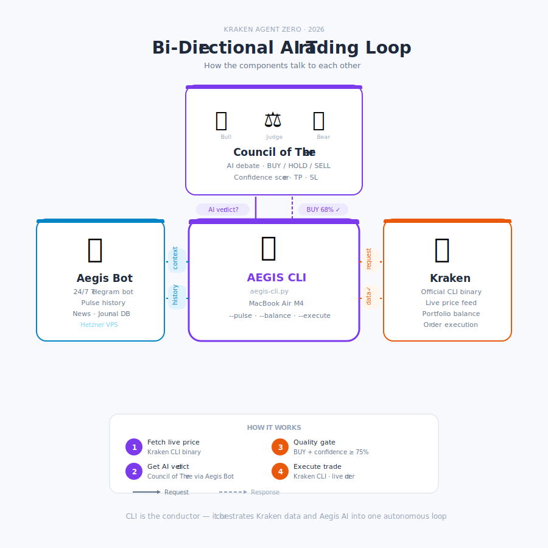

# 🛡️ Aegis CLI — Bi-Directional AI Trading Loop

> **Kraken Agent Zero Contest Submission · 2026**

A standalone command-line tool that connects the [Kraken CLI binary](https://github.com/krakenfx/kraken-cli) to the Aegis trading bot's AI engine — forming a true bi-directional loop between live exchange data and multi-agent AI reasoning.

```
$ python3 aegis-cli.py --execute TAO --validate

  ✓ Live price: $283.94  (+7.15%)  H: $287.82  L: $252.89
  ✓ Using live Aegis Council API (real engine · journal intelligence)

  🐂 THE BULL  Strong V-recovery from $252 demand zone...
  🐻 THE BEAR  $287 rejection warrants caution...
  ⚖️ THE JUDGE  BUY 68% — TP $300 / SL $271

  ✓ Quality gate passed (68% ≥ 75% threshold)
  ✓ Balance: $413.98 available
  ✓ ORDER VALIDATED — 0.17619 TAO @ $283.94 = $50.00
```

---

## Features

- **Three workflows** — AI analysis (`--pulse`), portfolio check (`--balance`), autonomous execution (`--execute`)
- **Real AI engine** — calls the live Aegis bot's Council of Three via HTTP, not a local reimplementation
- **Multi-agent debate** — Bull, Bear, and Judge personas powered by Claude (Anthropic) debate each trade
- **Journal intelligence** — 2-day pulse history feeds back into every verdict for continuous improvement
- **Quality gate** — confidence threshold blocks low-conviction entries before capital is deployed
- **xStocks support** — tokenized equities (AAPLx, TSLAx) work alongside crypto
- **Validate mode** — full dry-run execution with `--validate` flag, safe for demos
- **Beautiful terminal output** — Rich-powered colour-coded debate rendering

---

## Quick start (2 minutes)

```bash
# 1. Clone
git clone https://github.com/SomecodeA/aegis-cli.git
cd aegis-cli

# 2. Install dependencies
pip3 install anthropic rich aiohttp

# 3. Install Kraken CLI
curl --proto '=https' --tlsv1.2 -LsSf \
  https://github.com/krakenfx/kraken-cli/releases/latest/download/kraken-installer.sh | sh
kraken auth set --api-key YOUR_KEY --api-secret YOUR_SECRET

# 4. Configure
cp .env.example .env
# Add ANTHROPIC_API_KEY and SERPER_API_KEY at minimum

# 5. Run
python3 aegis-cli.py --pulse ETH
python3 aegis-cli.py --balance
python3 aegis-cli.py --execute TAO --validate
```

---

## Architecture



The CLI is the conductor. It fetches live data from Kraken, asks the Aegis Bot's AI engine for a verdict, then executes the trade back on Kraken — a true bi-directional loop.

> **The Council of Three AI engine lives in the [Aegis Bot](#aegis-bot-connection) (private production system).** The CLI calls it via HTTP — verdicts are identical to those the live bot generates 24/7. A standalone fallback is included for when the API is unreachable, but the real intelligence is in the production engine.

---

## Demo

📹 **[Watch the demo video on X →](https://x.com/cr7p2o/status/2058971438535803301?s=20)**

---

## How it works

```
┌─────────────────────────────────────────────────────────┐
│                                                         │
│  ┌──────────────────────┐        ┌──────────────────┐   │
│  │   Aegis Ecosystem    │        │     Kraken       │   │
│  │  ┌────────────────┐  │        │                  │   │
│  │  │   Aegis Bot    │  │        │  kraken ticker   │   │
│  │  │ (24/7 on VPS)  │  │        │  kraken balance  │   │
│  │  └───────┬────────┘  │        │  kraken order    │   │
│  │          │            │        │                  │   │
│  │  ┌───────▼────────┐  │        └────────┬─────────┘   │
│  │  │ Council of 3   │  │                 │             │
│  │  │ 🐂 🐻 ⚖️        │◄─┼─────────────────┼─► AEGIS CLI │
│  │  │ Claude AI      │  │                 │  (conductor)│
│  │  └────────────────┘  │                 │             │
│  └──────────────────────┘        └─────────────────────┘
└─────────────────────────────────────────────────────────┘
```

---

## Three workflows

### `--pulse <TICKER>` — AI analysis

```bash
python3 aegis-cli.py --pulse TAO
python3 aegis-cli.py --pulse AAPLx    # xStocks supported
python3 aegis-cli.py --pulse ETH
```

Fetches live price from Kraken CLI → sends to Council of Three → renders Bull / Bear / Judge debate with verdict and confidence score.

### `--balance` — Live portfolio

```bash
python3 aegis-cli.py --balance
```

Calls `kraken balance -o json` to display your live Kraken portfolio.

### `--execute <TICKER>` — Autonomous loop

```bash
# Dry-run — validates without placing a real order
python3 aegis-cli.py --execute TAO --validate

# Live — places a real order
python3 aegis-cli.py --execute TAO --amount 50

# Adjust quality gate threshold
python3 aegis-cli.py --execute TAO --gate 60
```

The full five-step autonomous loop:

1. **AI analysis** — Council of Three verdict via Aegis bot
2. **Quality gate** — blocks if not BUY or confidence below threshold
3. **Balance check** — verifies sufficient USD via `kraken balance`
4. **Price discovery** — fetches live price via `kraken ticker`
5. **Order execution** — places limit order via `kraken order buy`

---

## Installation

### Prerequisites

**Python 3.11+**
```bash
brew install python@3.12   # macOS
python3 --version
```

**Kraken CLI**
```bash
curl --proto '=https' --tlsv1.2 -LsSf \
  https://github.com/krakenfx/kraken-cli/releases/latest/download/kraken-installer.sh | sh
kraken --version
kraken auth set --api-key YOUR_KEY --api-secret YOUR_SECRET
```

**Python dependencies**
```bash
pip3 install anthropic rich aiohttp
```

### Setup

```bash
git clone https://github.com/SomecodeA/aegis-cli.git
cd aegis-cli
cp .env.example .env
# Edit .env with your keys
python3 aegis-cli.py --balance
```

---

## Configuration

All configuration lives in `.env` — never hardcoded. Copy `.env.example` to get started.

| Variable | Description | Required |
|----------|-------------|----------|
| `ANTHROPIC_API_KEY` | Anthropic API key for Claude | Yes |
| `SERPER_API_KEY` | Serper API for news context | Recommended |
| `AEGIS_COUNCIL_URL` | URL of your Aegis bot's Council API | Recommended |
| `COUNCIL_API_KEY` | Shared secret for Council API auth | If URL is set |
| `AEGIS_TRADE_AMOUNT` | Default USD trade size | No (default: $50) |
| `AEGIS_QUALITY_GATE` | Min confidence % to execute | No (default: 75%) |
| `AEGIS_DB_PATH` | Local path to Aegis bot's SQLite DB | Optional |

> **Never commit your `.env` file.** It is already in `.gitignore`.

---

## Aegis Bot connection

This CLI is a standalone companion to the **Aegis trading bot** — a 24/7 autonomous AI trading system running on a VPS. The core bot is a private production system; this CLI demonstrates its intelligence layer via a secure API endpoint.

> **The Council of Three prompt, calibration examples, and journal intelligence all live in the Aegis bot — not in this repo.** This is intentional. The CLI calls the bot's real engine, ensuring the AI reasoning is production-grade and continuously improving.

The bot exposes a single endpoint the CLI calls:

```
POST /council
Content-Type: application/json
X-API-Key: <COUNCIL_API_KEY>

{"ticker": "TAO", "price": 283.94, "change_pct": 7.15, "high": 287.82, "low": 252.89}
```

**To run the Council API on your own Aegis bot**, add to your bot's `.env`:
```
COUNCIL_API_KEY=your_shared_secret
COUNCIL_API_PORT=8765
```

And map the port in `docker-compose.yml`:
```yaml
ports:
  - "8765:8765"
```

**If the Council API is unreachable**, the CLI falls back to a direct Anthropic API call using a minimal prompt — ensuring it always produces a verdict.

---

## Project structure

```
aegis-cli/
├── aegis-cli.py       # Main CLI script
├── architecture.svg   # System architecture diagram
├── .env.example       # Configuration template — copy to .env
├── .gitignore         # Excludes .env, databases, and secrets
└── README.md          # This file
```

---

## Security

- API keys loaded from `.env` at runtime — never hardcoded
- Server IP and port live in `.env` — never in source code
- Council API requires a shared secret (`X-API-Key` header)
- `--validate` flag recommended before any live execution
- `.env` and `*.db` excluded from git via `.gitignore`

---

## Built with

- [Kraken CLI](https://github.com/krakenfx/kraken-cli) — official Kraken exchange CLI binary
- [Claude by Anthropic](https://anthropic.com) — AI reasoning (Council of Three)
- [Rich](https://github.com/Textualize/rich) — terminal output
- [aiohttp](https://docs.aiohttp.org) — async HTTP

---

## License

MIT — free to use, modify, and build upon.

---

*Submitted to the [Kraken Agent Zero Contest](https://support.kraken.com/articles/agent-zero-promotion) · May 2026*
